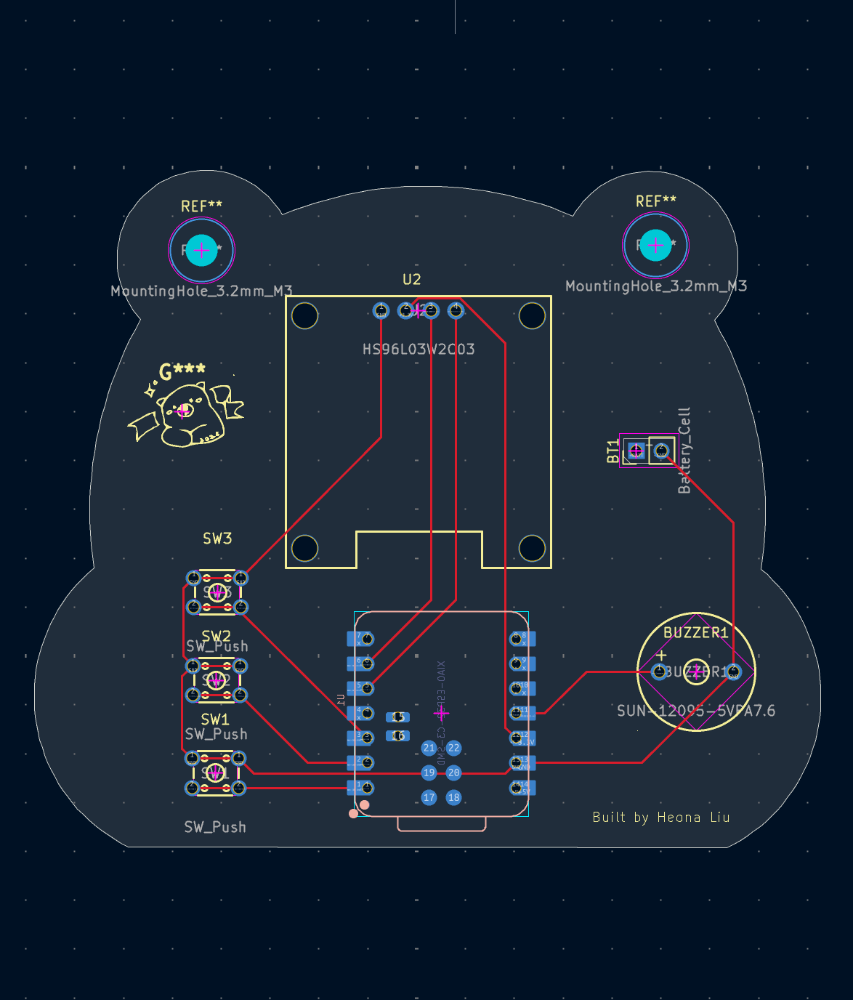

## Bear Tamagotchi

- PCB-based tamagotchi virtual pet with XIAO-ESP32-C3 by Heona Liu

## About This Project

- This follows the tutorial by [TaniWankenobi](https://github.com/TaniWanKenobi)

# PCB Design:
Images of PCB Design are below:

## Why I Made This Project
- I made this project because I am relatively new to hardware and thought this would be a good project to get some experience working with. This is also my first time using KiCad and working with the interface. First hardware project so everything was pretty much a learning process. It took many trial and errors like learning how to solve DRC errors, rerouting, and being very confused at some points.

