

# 🌸 Bearmagotchi

A custom bear-style case tamagotchi. Made by 17 y/o Heona Liu. This was my first full on hardware project, so I'm pretty proud of myself. Every step was a learning process: from KiCad interface, PCB routing, OnShape building, to coding with Arduino IDE for firmware and designing a zine.

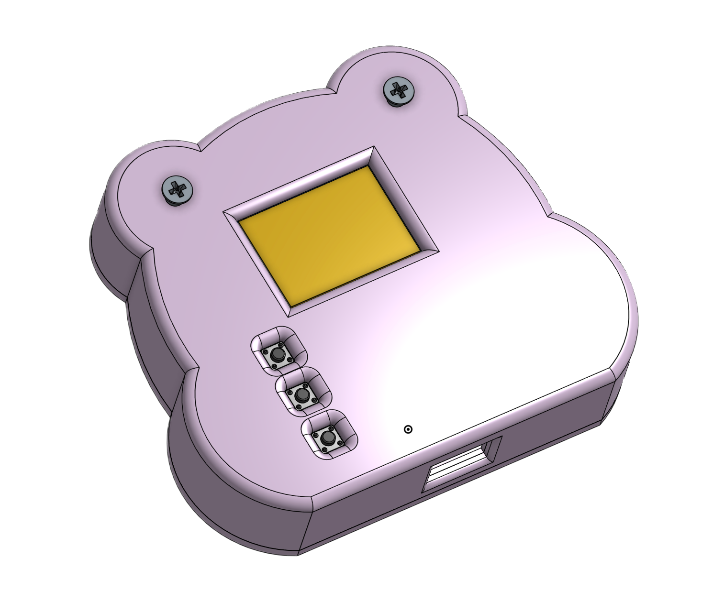

This tamagotchi has 3 stats: hunger, energy, and happiness! You can play around with the different levels by using the buttons, each mapped to different functions. This was built by following [TaniWankenobi's](https://github.com/TaniWanKenobi) tamagotchi PCB tutorial. All 4 faces on the bearmagotchi are custom drawn!

## Why I Built This Project
I built this project because I have absolute 0 experience with hardware and wanted to learn! I find it so exciting to be able to design physical products! I'm more of a software person so working with hardware isn't easy for me. I procrastinated a lot because I was intimidated at first by hardware and its complexities, but I finally got the discipline and perseverance to start and finish this project. Throughout this project, I encountered many challenges and learning experiences, all which allowed me to further broaden my understanding of hardware and CAD. I also like cute things so this was a perfect project to build.

It took many trial and errors like learning how to solve DRC errors, rerouting, and being very confused at some points.

######## ZINE HERE

## Overview
Bearmagotchi was built with Seeed Studio XIAO ESP32-C3 and a custom PCB built with KiCad. OnShape was used to build the case design. Arduino IDE was used to code the button's functions with the OLED screen.

### Key Parts Used:
- **Arduino MCU:** XIAO-ESP32-C3
- **Display:** 0.96" OLED screen
- **Power:** 3.7V rechargeable lithium polymer battery
- **Audio:** Buzzer -- [XHXDZ 1207-P6.5MM](https://www.lcsc.com/product-detail/C49246964.html)
- **Case:** Built with OnShape. View [Onshape CAD Link](https://cad.onshape.com/documents/021afe4b63c8b0b9c93cc183/w/f948377fc55dfd0736b0e217/e/5203c0fddfe92074836b1ae6?renderMode=0&uiState=6a3327ec9c87a1f6b1d3d4b6)
- **Firmware:** Arduino IDE in C++. Also wired and tested in a simulation in Wokwi.com. [Wokwi Link Here](https://wokwi.com/projects/467099855244316673)

- **Buzzer:** [XHXDZ 1207-P6.5MM](https://www.lcsc.com/product-detail/C49246964.html)
Switches: [BZCN TSC016A04518A](https://www.lcsc.com/product-detail/C2888493.html)
0.96" Oled Screen: [HS HS96L03W2C03](https://www.lcsc.com/product-detail/C5248080.html)

## Case Showcase
| **Top** | **Top Side View** |
| :--: | :--: |
| 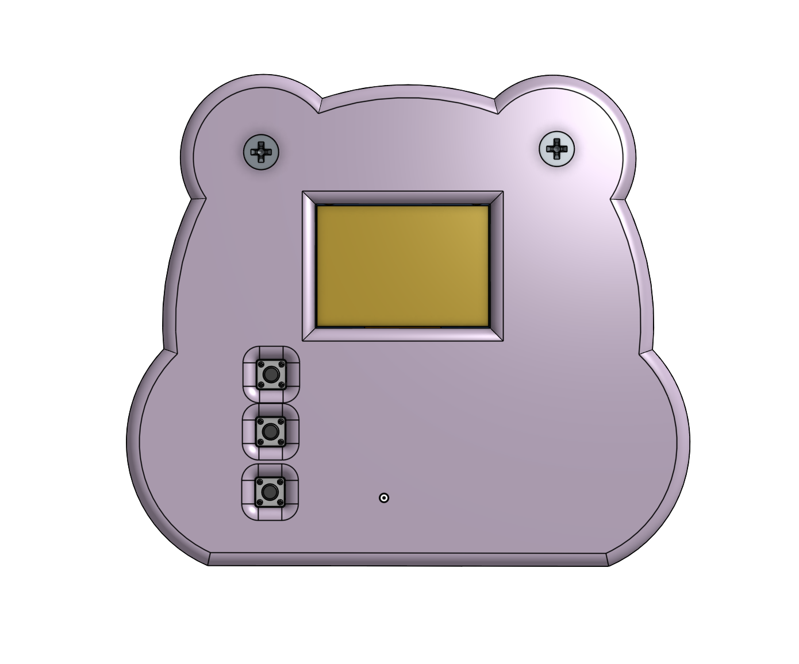 | |
| **Bottom** | **Exploded View** |
| 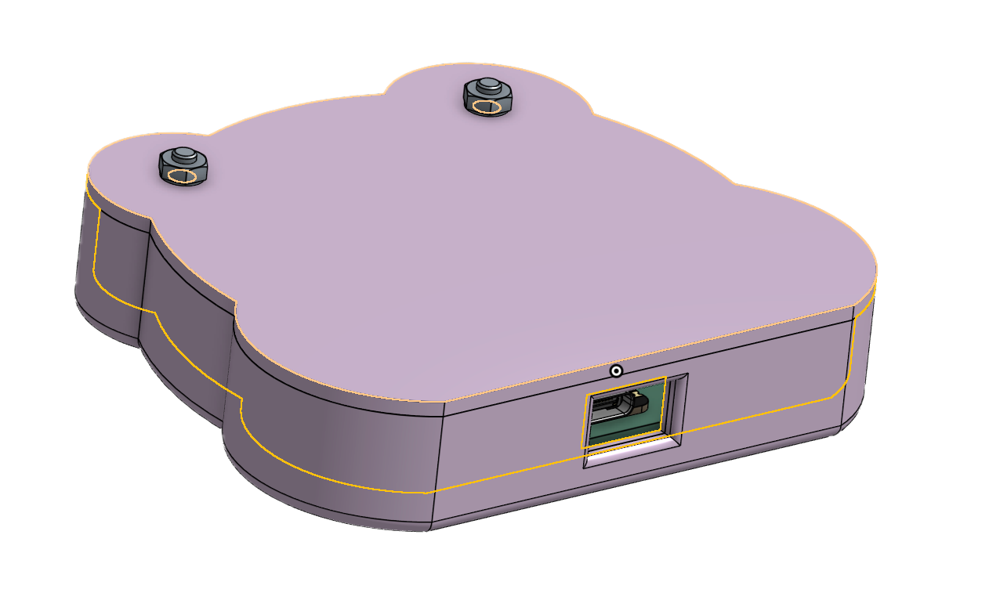 | 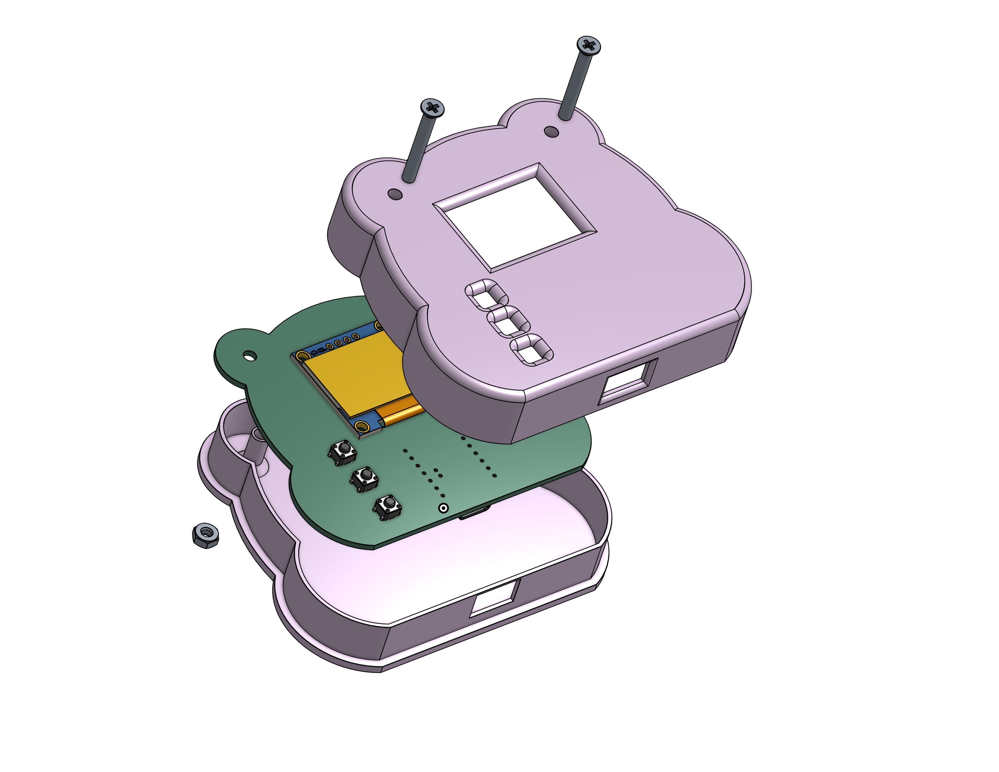|

## PCB & Routing
| **Top** | **Top Routing Layer** |
| :--: | :--: |
| 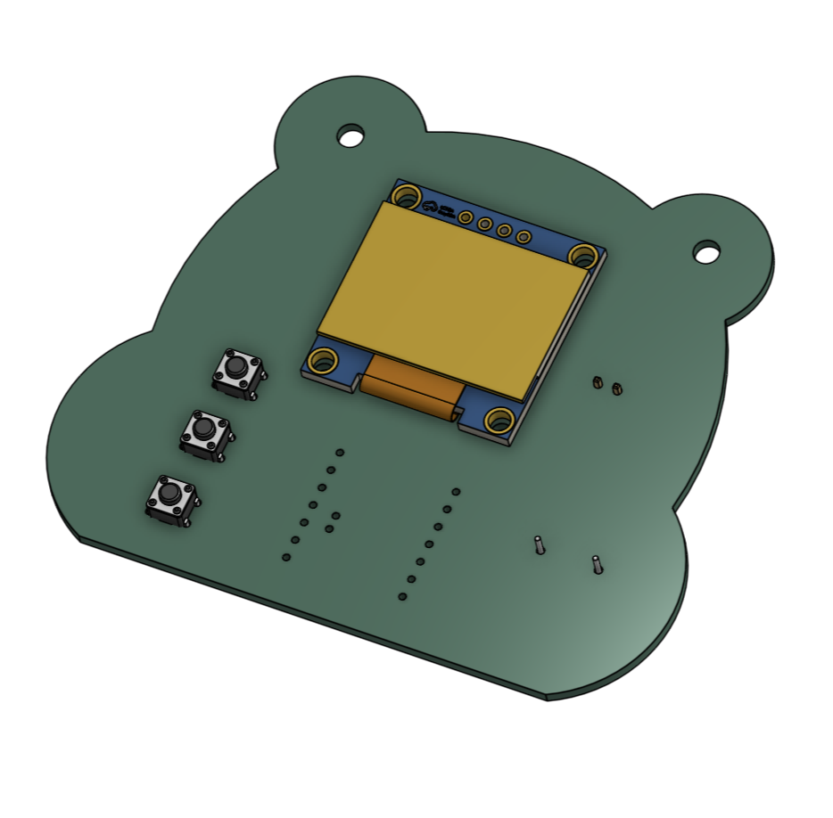 | 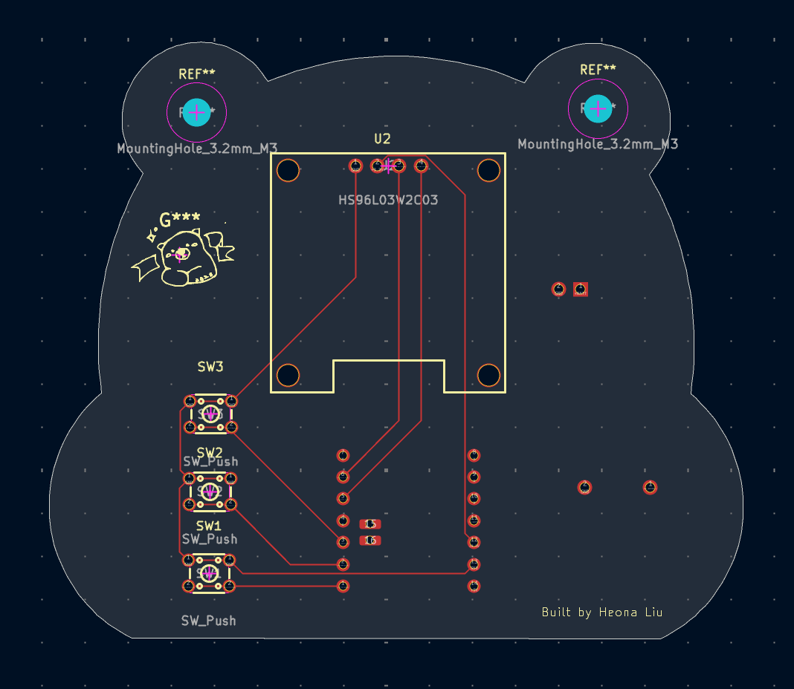|
| **Bottom** | **Bottom Routing Layer** |
| 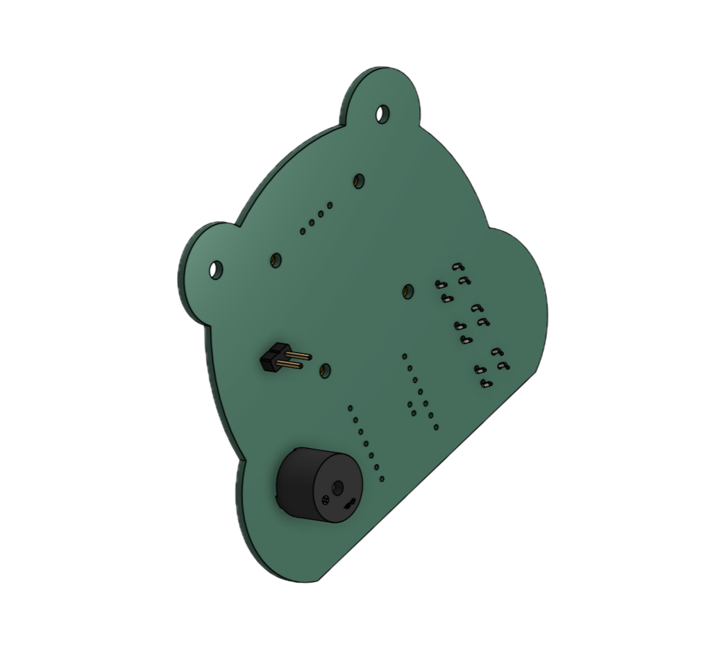 | 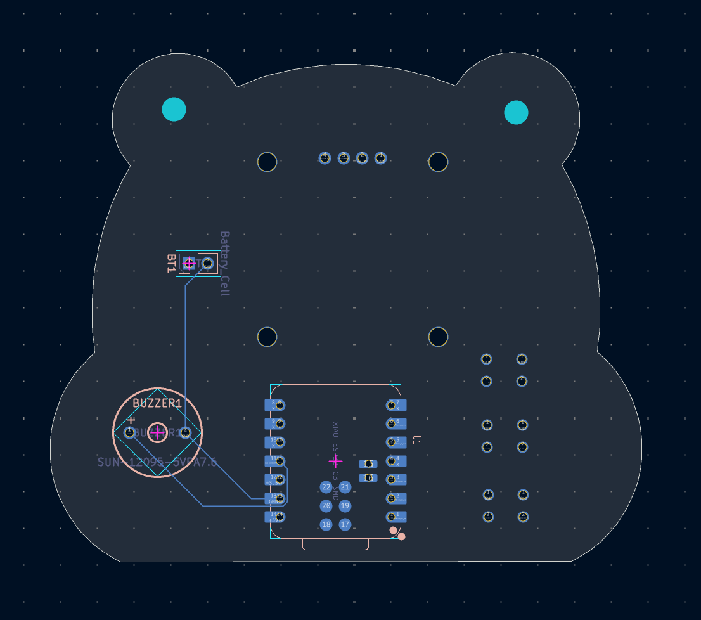|
|**Both**|

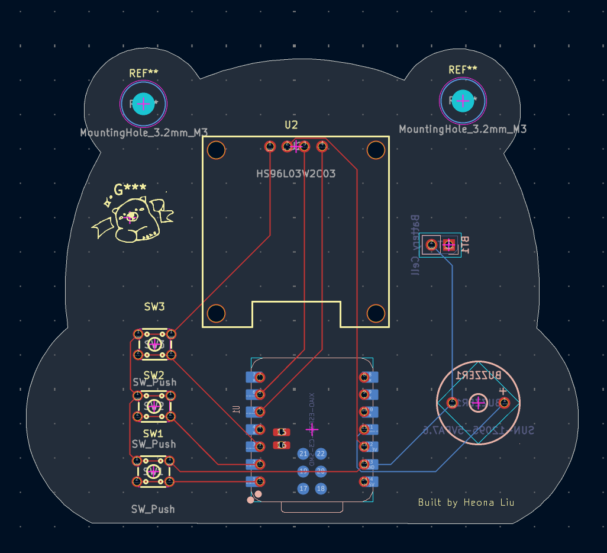

## Schematic
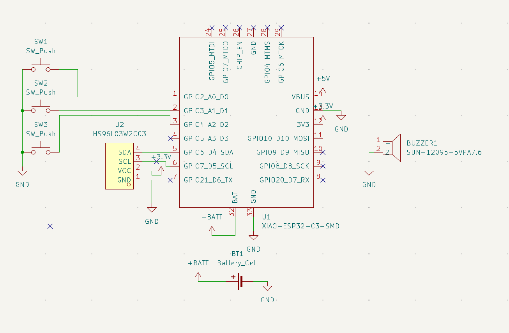

## Bill of Materials -- BOM:
| **Item** | **Description** | **Value** | **LCSC Part** | **Qty** | **MOQ** | **Total Price** | **Links** |
| :--: | :--: | :--: | :--: | :--: |:--: |:--: | :--: |
| Battery | Cell battery to power | Battery_Cell | -- | 1 | 1 | $3.37 | [Purchase Link](https://www.aliexpress.us/item/3256805856928609.html?gatewayAdapt=glo2usa4itemAdapt)
| Buzzer | Buzzer for audio | 1207-P6.5MM | C49246964 | 1 | 10 | $0.57 | [Purchase Link](https://www.lcsc.com/product-detail/C49246964.html)
| Switch | Push button | TSC016A04518A | C2888493 | 3 | 50 | $0.54 | [Purchase Link](https://www.lcsc.com/product-detail/C2888493.html)
| OLED Display | 0.96" OLED | HS96L03W2C03 | C5248080 | 1 | 1 | $2.25 | [Purchase Link](https://www.lcsc.com/product-detail/C5248080.html)
| Seeed Studio ESP32-C3 MCU | MCU Arduino board | XIAO-ESP32-C3-SMD | -- | 1 | 1 | $4.54 | [Purchase Link](https://www.aliexpress.us/item/3256806793530218.html?gatewayAdapt=glo2usa4itemAdapt)
| PCB | Main board for building | -- | -- | 1 | 1 | $4.00 | --
|PCB Shipping | To UPS Account | -- | -- | -- | -- | $2.50 | --
| **Total** |  |  |  | **8** | **64** | **$17.77** | |

## Structural (Screws, Nuts) -- BOM:
| **Item** | **Description** | **Qty**  | **Total Price** | **Link**
| :--: | :--: | :--: | :--: |:--: |
| M3 x 25mm Screw | PH Countersunk flat head screw M3x0.5 x 25 Stainless Steel  | 2 | $1.74 | [Purchase Link](https://accu-components.com/us/countersunk-socket-head-screws/5430-SSK-M3-25-A2?google_shopping=1&c=2&gad_source=1&gad_campaignid=23876758716&gbraid=0AAAAADI7_w52Pj9fyJw7edzbYGgzAQiUG&gclid=Cj0KCQjwi8nRBhDhARIsAHZf_pZVKr8Kq71Xx-DJNwKNpfBIvS0pRFolBN9PN9_BSy07MO-u1rrJDKAaAufbEALw_wcB) |
| Hex Nut Grade A&B | M3x0.5  Stainless Steel  | 2 | $0.14 | [Purchase Link](https://belmetric.com/hex-nut-a2-stainless-din-934/?gad_source=1&gad_campaignid=21832963163&gbraid=0AAAAADn8Oc-E5kanGq3jWoaFNa1ESFVPE&gclid=Cj0KCQjwi8nRBhDhARIsAHZf_pacy6ZhzrGPmuq_yMzfeMh5XljB88UODfhdwc5PXWL3VzwXYlfHfLoaAkIGEALw_wcB&sku=NR3SS) |
| Total | | 4 | $1.88 | |

## Assembly
| **Bottom case** | **Place PCB on top** |
| :--: | :--: |
| 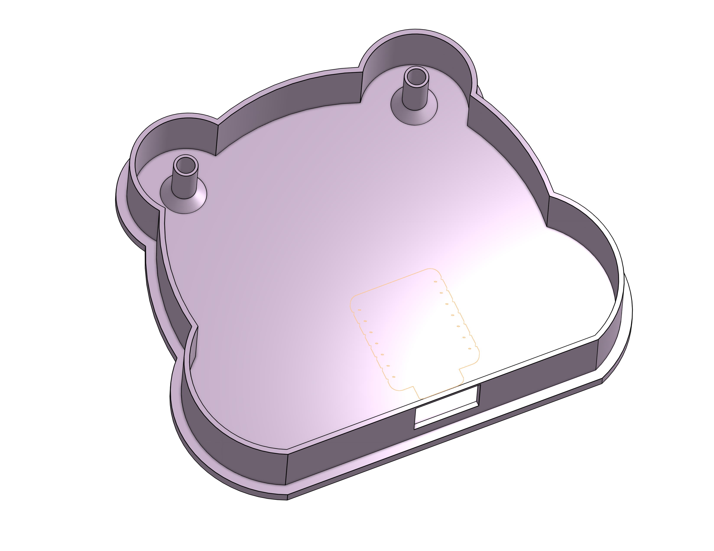 | 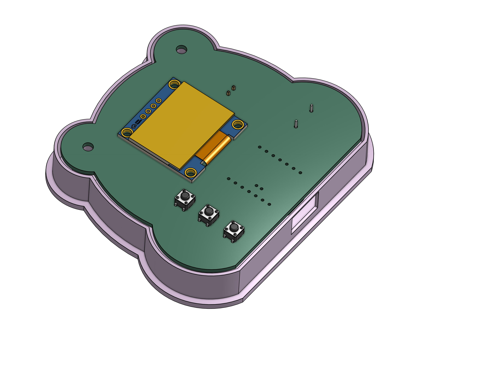|
| **Place top cover aligned with the holes** | **Put in the M3 Screws & fasten with hex nuts** |
| 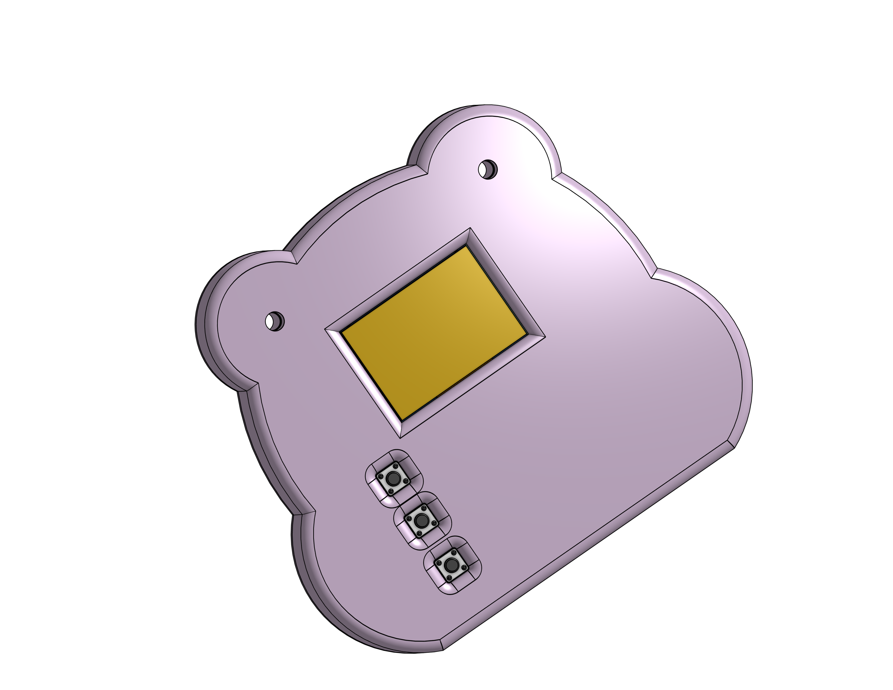 | 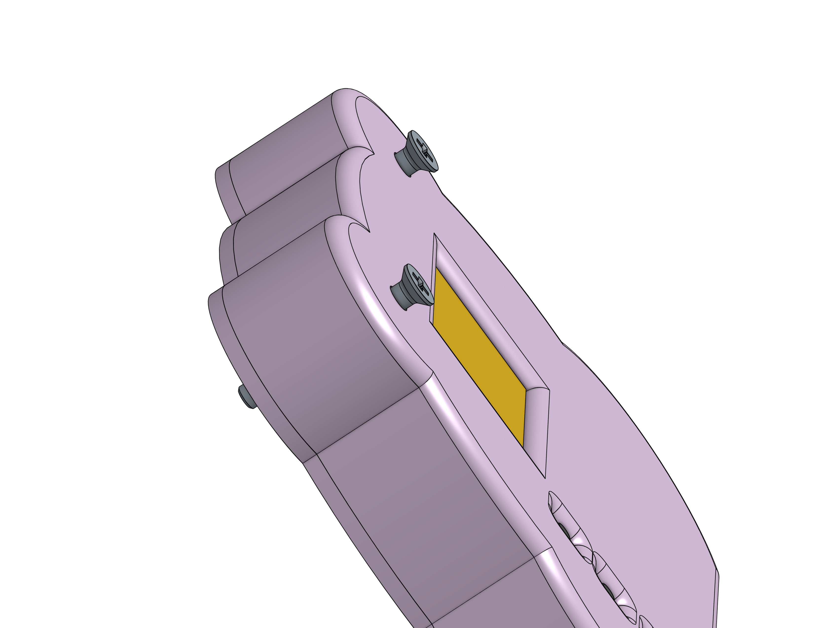|

## Credits:
- This follows the tutorial by [TaniWankenobi](https://github.com/TaniWanKenobi)
- Case tutorial (for reference) by [Pcb Cupid](https://www.youtube.com/watch?v=7FC-pByCCXM) on YouTube
- README Formating & File Organization Inspiration: [DjukicAleksej](https://github.com/DjukicAleksej)

 

